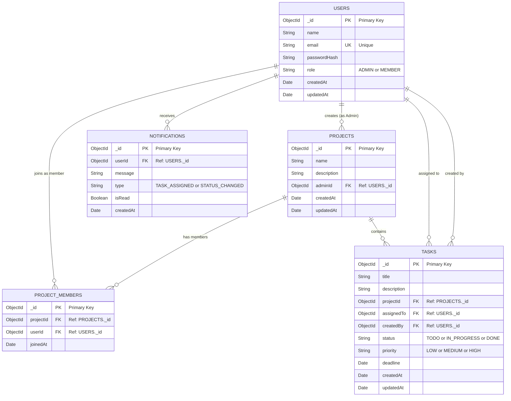

# TaskFlow – Entity Relationship Diagram

> **Database:** MongoDB (document-oriented; relationships modeled via references)

---

## ER Diagram

```mermaid
erDiagram
    USERS {
        ObjectId _id PK "Primary Key"
        String name
        String email UK "Unique"
        String passwordHash
        String role "ADMIN or MEMBER"
        Date createdAt
        Date updatedAt
    }

    PROJECTS {
        ObjectId _id PK "Primary Key"
        String name
        String description
        ObjectId adminId FK "Ref: USERS._id"
        Date createdAt
        Date updatedAt
    }

    PROJECT_MEMBERS {
        ObjectId _id PK "Primary Key"
        ObjectId projectId FK "Ref: PROJECTS._id"
        ObjectId userId FK "Ref: USERS._id"
        Date joinedAt
    }

    TASKS {
        ObjectId _id PK "Primary Key"
        String title
        String description
        ObjectId projectId FK "Ref: PROJECTS._id"
        ObjectId assignedTo FK "Ref: USERS._id"
        ObjectId createdBy FK "Ref: USERS._id"
        String status "TODO or IN_PROGRESS or DONE"
        String priority "LOW or MEDIUM or HIGH"
        Date deadline
        Date createdAt
        Date updatedAt
    }

    NOTIFICATIONS {
        ObjectId _id PK "Primary Key"
        ObjectId userId FK "Ref: USERS._id"
        String message
        String type "TASK_ASSIGNED or STATUS_CHANGED"
        Boolean isRead
        Date createdAt
    }

    USERS ||--o{ PROJECTS : "creates (as Admin)"
    USERS ||--o{ PROJECT_MEMBERS : "joins as member"
    PROJECTS ||--o{ PROJECT_MEMBERS : "has members"
    PROJECTS ||--o{ TASKS : "contains"
    USERS ||--o{ TASKS : "assigned to"
    USERS ||--o{ TASKS : "created by"
    USERS ||--o{ NOTIFICATIONS : "receives"
```

---

