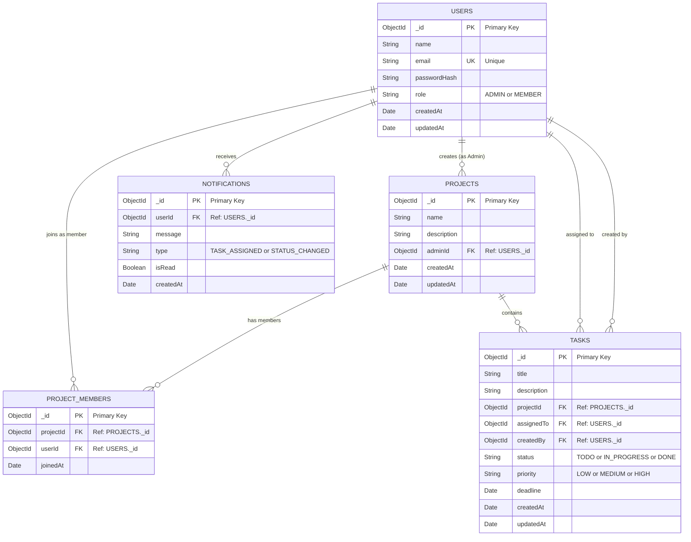

# TaskFlow – Entity Relationship Diagram

> **Milestone:** 1 | **Diagram Type:** ER Diagram
> **Database:** MongoDB (document-oriented; relationships modeled via references)

---

## ER Diagram

---

## Index Recommendations

| Collection | Field(s) | Index Type | Purpose |
|-----------|---------|-----------|---------|
| `USERS` | `email` | Unique Index | Login lookup; must be unique |
| `USERS` | `role` | Single Field | Filter by Admin or Member |
| `PROJECTS` | `adminId` | Single Field | Fetch projects by Admin |
| `PROJECT_MEMBERS` | `projectId` | Single Field | Fetch members of a project |
| `PROJECT_MEMBERS` | `userId` | Single Field | Fetch projects a user belongs to |
| `PROJECT_MEMBERS` | `(projectId, userId)` | Compound Unique | Prevent duplicate memberships |
| `TASKS` | `projectId` | Single Field | Fetch tasks under a project |
| `TASKS` | `assignedTo` | Single Field | Fetch tasks assigned to a member |
| `TASKS` | `status` | Single Field | Filter by task status |
| `TASKS` | `deadline` | Single Field | Query overdue tasks |
| `TASKS` | `(projectId, status)` | Compound Index | Dashboard analytics per project |
| `NOTIFICATIONS` | `userId` | Single Field | Fetch notifications for a user |
| `NOTIFICATIONS` | `(userId, isRead)` | Compound Index | Fetch unread notifications |
