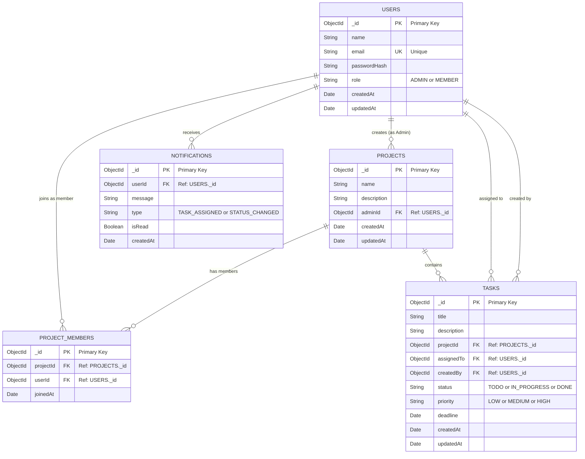
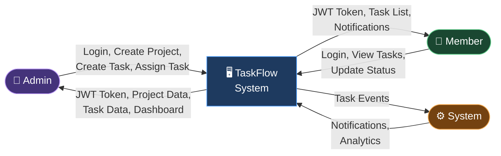
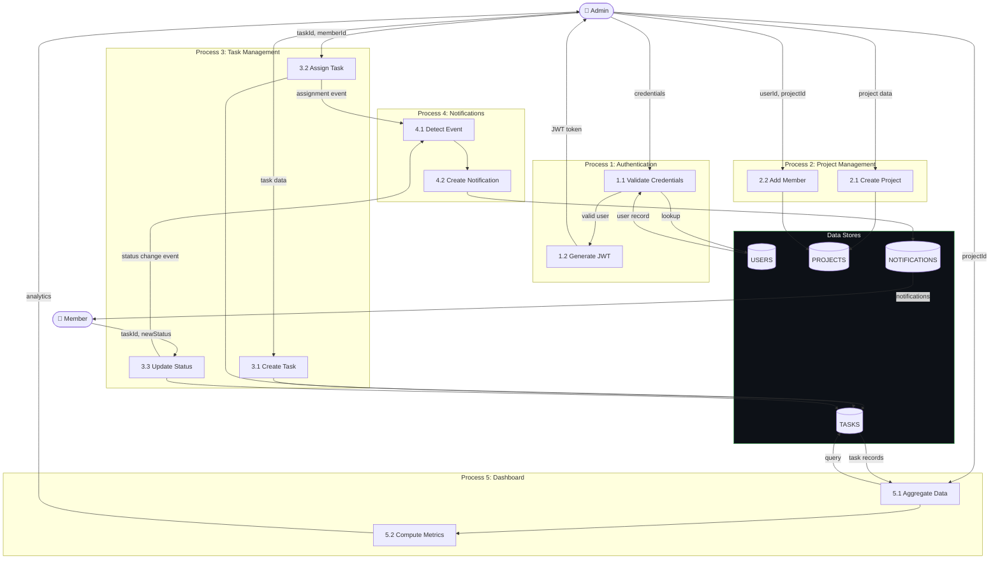

# TaskFlow – Entity Relationship Diagram

> **Milestone:** 1 | **Diagram Type:** ER Diagram + Data Flow Diagrams
> **Database:** MongoDB (document-oriented; relationships modeled via references)

---

## 1. ER Diagram

---

## 2. Data Flow Diagram – Level 0 (Context Diagram)

---

## 3. Data Flow Diagram – Level 1 (Internal Processes)

---

## 4. Relationship Summary Table

| Relationship | Type | From Entity | To Entity | Description |
|-------------|------|-------------|-----------|-------------|
| **User creates Project** | One-to-Many (1:N) | `USERS` | `PROJECTS` | One Admin can create many Projects. Each Project has exactly one Admin. |
| **User joins Project** | Many-to-Many (M:N) | `USERS` ↔ `PROJECTS` | `PROJECT_MEMBERS` | A User can be a member of many Projects; a Project can have many Members. Resolved via the `PROJECT_MEMBERS` junction collection. |
| **Project contains Tasks** | One-to-Many (1:N) | `PROJECTS` | `TASKS` | One Project can have many Tasks. Each Task belongs to exactly one Project. |
| **User assigned to Tasks** | One-to-Many (1:N) | `USERS` | `TASKS` | One Member can be assigned many Tasks. Each Task is assigned to at most one Member. |
| **User creates Tasks** | One-to-Many (1:N) | `USERS` | `TASKS` | One Admin can create many Tasks. Tracked via `createdBy` field. |
| **User receives Notifications** | One-to-Many (1:N) | `USERS` | `NOTIFICATIONS` | One User can receive many Notifications. Each Notification targets exactly one User. |

---

## 5. Index Recommendation

| Collection | Field(s) | Index Type | Justification |
|-----------|---------|-----------|---------------|
| `USERS` | `email` | **Unique Index** | Login lookup by email; must be unique across all users |
| `USERS` | `role` | Single Field | Filter users by role (Admin / Member) |
| `PROJECTS` | `adminId` | Single Field | Fetch all projects created by a specific Admin |
| `PROJECT_MEMBERS` | `projectId` | Single Field | Fetch all members of a specific project |
| `PROJECT_MEMBERS` | `userId` | Single Field | Fetch all projects a specific user belongs to |
| `PROJECT_MEMBERS` | `(projectId, userId)` | **Compound Unique** | Prevent duplicate membership entries |
| `TASKS` | `projectId` | Single Field | Fetch all tasks under a specific project |
| `TASKS` | `assignedTo` | Single Field | Fetch all tasks assigned to a specific member |
| `TASKS` | `status` | Single Field | Filter tasks by lifecycle status |
| `TASKS` | `deadline` | Single Field | Query overdue tasks (deadline < current date) |
| `TASKS` | `(projectId, status)` | **Compound Index** | Dashboard analytics: count tasks by status per project |
| `NOTIFICATIONS` | `userId` | Single Field | Fetch all notifications for a specific user |
| `NOTIFICATIONS` | `(userId, isRead)` | **Compound Index** | Fetch unread notifications for a user efficiently |

---

## 6. Data Integrity Notes

| Rule | Description |
|------|-------------|
| **Referential Integrity** | MongoDB does not enforce foreign keys natively. Application-level validation must ensure referenced documents exist before insertion. |
| **Soft Deletes** | Consider adding an `isDeleted` boolean field to `USERS`, `PROJECTS`, and `TASKS` to support soft deletion without data loss. |
| **Timestamps** | All collections include `createdAt` and `updatedAt` fields, managed automatically via Mongoose `timestamps: true`. |
| **Enum Validation** | `status`, `priority`, `role`, and `type` fields are validated at the application layer using Mongoose `enum` constraints. |
