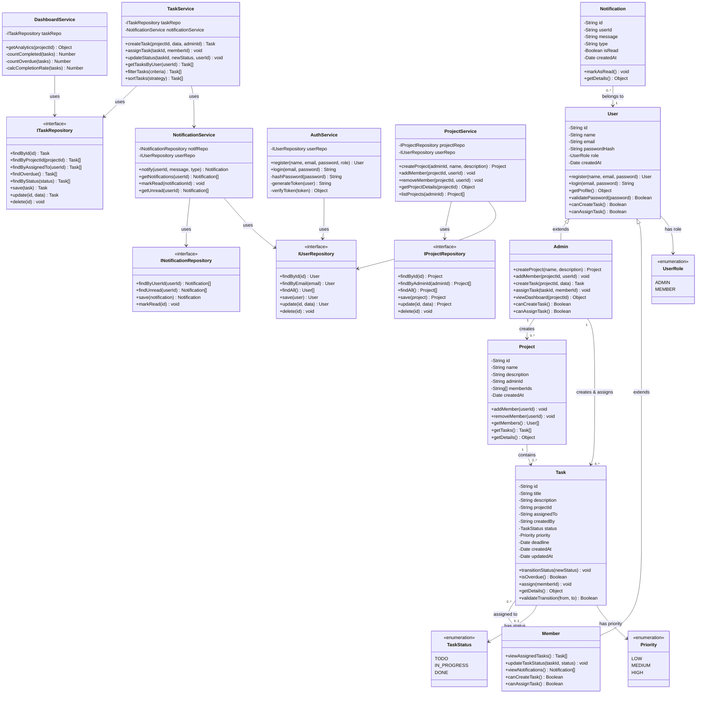
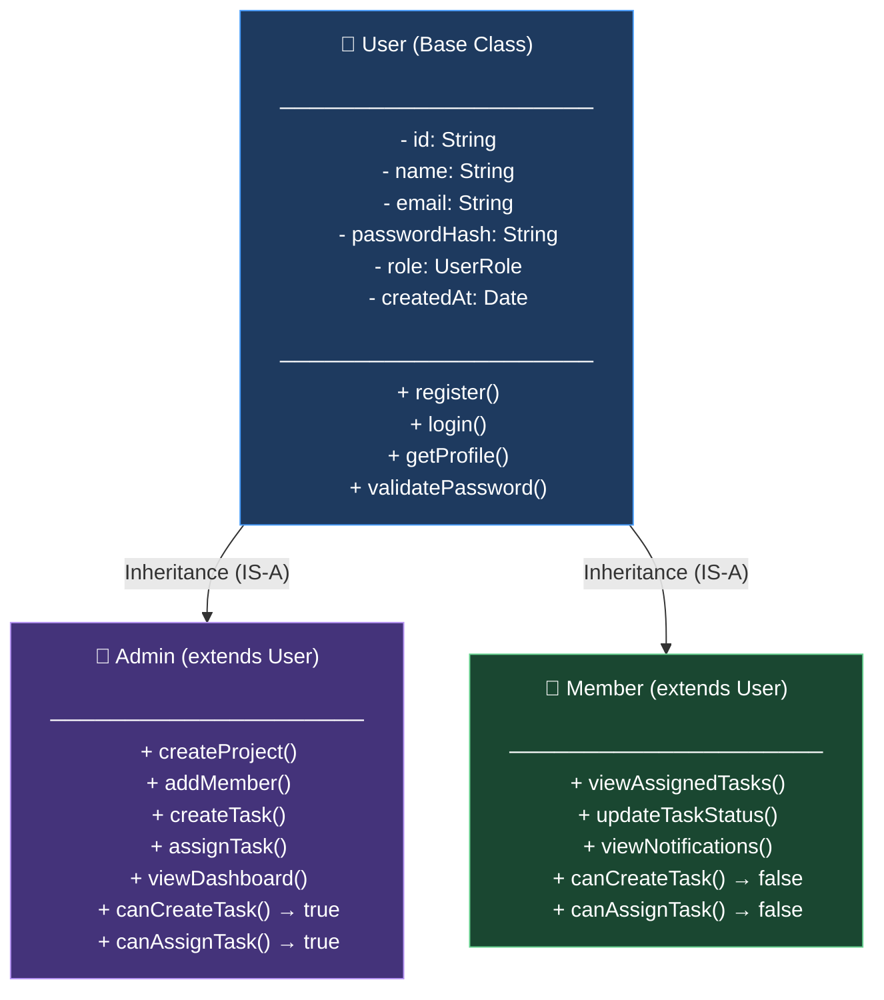
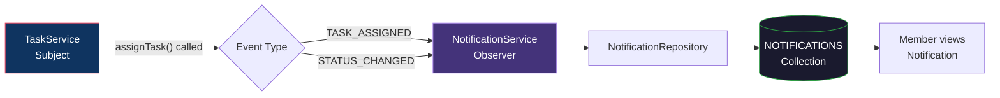

# TaskFlow – Class Diagram

> **Milestone:** 1 | **Diagram Type:** Class Diagram + Inheritance & Pattern Flowcharts

---

## 1. Full Class Diagram

---

## 2. Inheritance Hierarchy Flowchart

---

## 3. Observer Pattern Flowchart (Notification System)

---

## 4. Design Pattern Mapping Table

| Design Pattern | Class(es) Involved | How It Is Applied |
|---------------|-------------------|-------------------|
| **Repository Pattern** | `IUserRepository`, `IProjectRepository`, `ITaskRepository`, `INotificationRepository` | Interfaces abstract all database operations. Services depend on interfaces, not concrete implementations. Enables swapping MongoDB for any other database without changing business logic. |
| **State Pattern** | `Task`, `TaskStatus` | The `Task.transitionStatus()` method enforces valid state transitions: `TODO → IN_PROGRESS → DONE`. Invalid transitions are rejected by `validateTransition()`. |
| **Observer Pattern** | `TaskService`, `NotificationService` | `TaskService` (Subject) calls `NotificationService.notify()` (Observer) after task assignment or status change. Notification logic is fully decoupled from task logic. |
| **Strategy Pattern** | `TaskService.filterTasks()`, `TaskService.sortTasks()` | Filtering and sorting algorithms are passed as strategies at runtime, allowing different criteria (by priority, deadline, status) to be applied interchangeably. |
| **Singleton Pattern** | Database Connection (conceptual) | The MongoDB connection is instantiated once and reused across all repositories. Prevents connection pool exhaustion. |

---

## 5. OOP Principle Mapping Table

| OOP Principle | Class(es) Involved | How It Is Applied |
|--------------|-------------------|-------------------|
| **Encapsulation** | `User`, `Task`, `Project`, `Notification` | Private fields (`-`) are only accessible through public methods (`+`). Internal state (e.g., `passwordHash`, `status`) is hidden from external consumers. |
| **Abstraction** | `IUserRepository`, `IProjectRepository`, `ITaskRepository`, `INotificationRepository` | Repository interfaces expose only what is needed (CRUD operations). Concrete MongoDB implementations are hidden behind these abstractions. |
| **Inheritance** | `User → Admin`, `User → Member` | `Admin` and `Member` inherit common attributes (`id`, `name`, `email`, `passwordHash`, `role`) from `User` and add role-specific methods. |
| **Polymorphism** | `Admin`, `Member` | Both classes override `canCreateTask()` and `canAssignTask()`. `Admin` returns `true`; `Member` returns `false`. The system resolves the correct behavior at runtime based on the user's role. |
