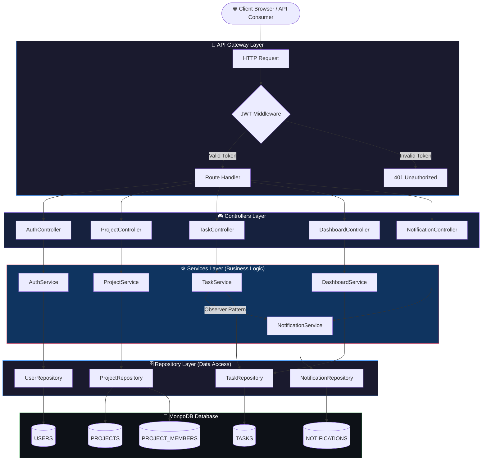
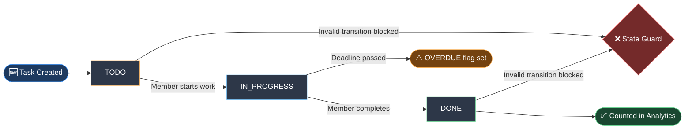

# TaskFlow – Team Task & Project Management System

> **Course:** Software Engineering & System Design (SESD)
> **Milestone:** 1 – Project Ideation & System Design
> **Weightage:** Backend 75% | Frontend 25%
> **Date:** February 2026

---

## 1. Overview

**TaskFlow** is a backend-focused, role-based team task and project management system designed to streamline collaborative work within organizations. It enables Admins to create projects, manage team members, and assign tasks with priorities and deadlines, while Members can track and update the status of their assigned work.

The system incorporates an event-driven notification engine and a dashboard analytics module to provide actionable insights into project health. The architecture follows a clean, layered backend design grounded in Object-Oriented Programming (OOP) principles and industry-standard design patterns.

---

## 2. Problem Statement

1. Teams lack a centralized, role-aware system to manage tasks across multiple projects simultaneously.
2. There is no automated mechanism to notify team members when tasks are assigned or their status changes.
3. Project managers cannot easily track task completion rates, overdue items, or team workload distribution.
4. Existing lightweight tools do not enforce a structured task lifecycle (Todo → In Progress → Done).
5. Role-based access control is often absent, leading to unauthorized modifications of project data.
6. Dashboard analytics for real-time project health monitoring are typically unavailable in simple tools.
7. There is no clean separation between data access and business logic, making systems hard to maintain.

---

## 3. Scope

###  In Scope

| # | Feature |
|---|---------|
| 1 | User Registration and Login with JWT-based authentication |
| 2 | Role-based access control (Admin / Member) |
| 3 | Admin: Create and manage projects |
| 4 | Admin: Add members to projects |
| 5 | Admin: Create, assign, and manage tasks |
| 6 | Member: View assigned tasks |
| 7 | Member: Update task status (Todo → In Progress → Done) |
| 8 | Task attributes: Priority (Low / Medium / High), Deadline |
| 9 | Dashboard analytics: Total, Completed, Overdue tasks, Completion % |
| 10 | Notification system: Triggered on task assignment and status change |

###  Out of Scope

| # | Feature |
|---|---------|
| 1 | Real-time WebSocket communication |
| 2 | File attachments or media uploads |
| 3 | Third-party integrations (Slack, Jira, GitHub) |
| 4 | Mobile application (iOS / Android) |
| 5 | Payment or subscription management |
| 6 | Multi-tenancy / SaaS architecture |
| 7 | Advanced reporting or PDF export |
| 8 | Email or SMS notification delivery |

---

## 4. Core Modules

| Module | Description | Key Responsibilities |
|--------|-------------|---------------------|
| **Auth Module** | User registration, login, JWT management | Register, Login, Token validation, Role extraction |
| **User Module** | User profile and role management | CRUD on users, role enforcement |
| **Project Module** | Project lifecycle and membership | Create project, Add/Remove members, List projects |
| **Task Module** | Core task management with lifecycle | Create task, Assign task, Update status, Filter/Sort |
| **Notification Module** | Event-driven notification system | Trigger on assignment, Trigger on status change |
| **Dashboard Module** | Aggregated analytics and reporting | Total/Completed/Overdue tasks, Completion % |

---

## 5. User Roles

| Role | Permissions | Restrictions |
|------|-------------|--------------|
| **Admin** | Create projects, Add members, Create tasks, Assign tasks, View dashboard, View all tasks | Cannot act as a regular member |
| **Member** | View assigned tasks, Update task status, View own notifications | Cannot create projects or assign tasks |
| **System** | Trigger notifications, Generate analytics | Internal actor only; no direct API access |

---

## 6. Technology Stack

| Layer | Technology | Purpose |
|-------|-----------|---------|
| **Runtime** | Node.js | Server-side JavaScript execution |
| **Framework** | Express.js | HTTP routing and middleware management |
| **Database** | MongoDB (via Mongoose) | NoSQL document storage |
| **Authentication** | JSON Web Tokens (JWT) | Stateless, role-based auth |
| **Password Hashing** | bcrypt | Secure credential storage |
| **Validation** | Joi / express-validator | Input sanitization and schema validation |
| **Environment Config** | dotenv | Secure environment variable management |
| **API Style** | RESTful API | Standard HTTP-based communication |
| **Frontend** | React.js (minimal) | UI for task views and dashboard |

---

## 7. System Architecture Flowchart

---

## 8. OOP Principles

| Principle | Application in TaskFlow |
|-----------|------------------------|
| **Encapsulation** | Each class (User, Task, Project) exposes only necessary methods; internal state is private. Services encapsulate business logic away from controllers. |
| **Abstraction** | Repository interfaces (IUserRepository, ITaskRepository) abstract data access details. Consumers interact with interfaces, not implementations. |
| **Inheritance** | `Admin` and `Member` extend the base `User` class, inheriting common attributes while adding role-specific behavior. |
| **Polymorphism** | Role-based method overriding — `Admin.canCreateTask()` returns `true`; `Member.canCreateTask()` returns `false`. Task filtering strategies are interchangeable via Strategy Pattern. |

---

## 9. Design Patterns

| Pattern | Where Applied | Justification |
|---------|--------------|---------------|
| **Repository Pattern** | `IUserRepository`, `IProjectRepository`, `ITaskRepository` | Decouples data access from business logic; enables testability |
| **State Pattern** | `Task` status transitions (Todo → In Progress → Done) | Enforces valid state transitions; prevents illegal status jumps |
| **Observer Pattern** | `NotificationService` observes task events | Decouples notification logic from task/project logic |
| **Strategy Pattern** | Task filtering and sorting in `TaskService` | Allows interchangeable filter/sort algorithms at runtime |
| **Singleton Pattern** | MongoDB database connection | Ensures a single shared connection instance across the application |

---

## 10. Task Lifecycle Flowchart

---

## 11. Non-Functional Requirements

| Category | Requirement |
|----------|-------------|
| **Security** | JWT tokens must be signed and validated on every protected route. Passwords hashed with bcrypt (salt rounds ≥ 10). |
| **Scalability** | Layered architecture allows independent scaling. MongoDB supports horizontal scaling. |
| **Maintainability** | Strict separation of concerns ensures each layer can be modified independently. |
| **Reliability** | Centralized error handling middleware catches and formats all errors consistently. |
| **Performance** | MongoDB indexes on frequently queried fields (userId, projectId, status, deadline). |
| **Testability** | Repository abstraction enables unit testing with mock data sources. |
| **Usability** | RESTful API follows standard HTTP conventions (status codes, JSON responses). |

---

## 12. Future Enhancements

| Enhancement | Description |
|-------------|-------------|
| **Real-time Notifications** | Integrate WebSockets (Socket.io) for live task updates |
| **Email Notifications** | Send email alerts via Nodemailer / SendGrid |
| **Advanced Analytics** | Team performance metrics, burndown charts |
| **File Attachments** | Allow task-level file uploads via AWS S3 |
| **Audit Logging** | Track all state changes with timestamps and actor info |
| **Multi-tenancy** | Support multiple organizations with isolated data |
| **Mobile API** | Extend REST API to support a React Native mobile client |
| **CI/CD Pipeline** | Automate testing and deployment via GitHub Actions |
