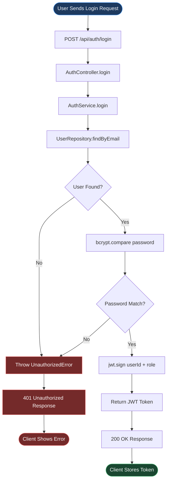
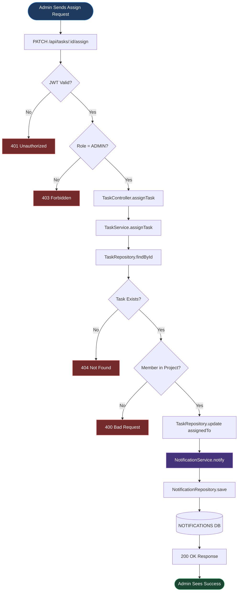
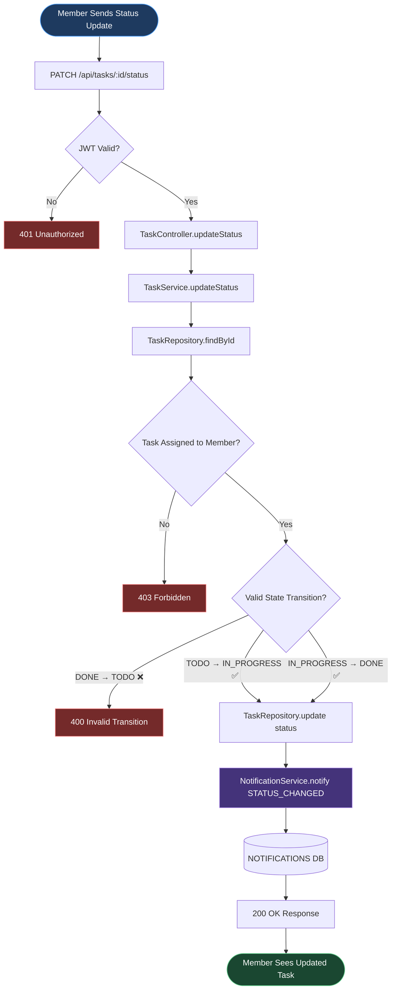

# TaskFlow – Sequence Diagram

> **Milestone:** 1 | **Diagram Type:** Sequence Diagram + Supporting Flowcharts
> **Main Flow:** Admin authenticates → creates a task → assigns it to a Member → System triggers notification

---

## 1. Main Sequence Diagram (5 Phases)

```mermaid
sequenceDiagram
    autonumber

    actor Admin
    participant Client
    participant Routes
    participant AuthController
    participant AuthService
    participant TaskController
    participant TaskService
    participant TaskRepository
    participant NotificationService
    participant NotificationRepository
    participant Database

    %% ════════════════════════════════════════════════════════════════════════
    %% PHASE 1: Authentication
    %% ════════════════════════════════════════════════════════════════════════
    rect rgb(14, 30, 60)
        Note over Admin, Database: PHASE 1 - Authentication

        Admin ->> Client: Enter credentials (email, password)
        Client ->> Routes: POST /api/auth/login
        Routes ->> AuthController: login(req, res)
        AuthController ->> AuthService: login(email, password)
        AuthService ->> Database: findUserByEmail(email)

        alt Authentication Failure
            Database -->> AuthService: null - user not found
            AuthService -->> AuthController: throw UnauthorizedError - Invalid credentials
            AuthController -->> Client: 401 Unauthorized - Invalid credentials
            Client -->> Admin: Show error message and stay on login page
        else Authentication Success
            Database -->> AuthService: User document returned
            AuthService ->> AuthService: validatePassword(password, hash)
            AuthService ->> AuthService: generateJWT(userId, role, expiresIn 7d)
            AuthService -->> AuthController: token JWT_TOKEN
            AuthController -->> Client: 200 OK - token and role ADMIN
            Client -->> Admin: Store token in localStorage and redirect to dashboard
        end
    end

    %% ════════════════════════════════════════════════════════════════════════
    %% PHASE 2: Task Creation
    %% ════════════════════════════════════════════════════════════════════════
    rect rgb(10, 40, 30)
        Note over Admin, Database: PHASE 2 - Task Creation

        Admin ->> Client: Fill task form with title, priority, deadline, projectId
        Client ->> Routes: POST /api/tasks with Bearer JWT_TOKEN
        Routes ->> Routes: JWT Middleware - verifyToken
        Routes ->> Routes: Role Guard - checkRole ADMIN
        Routes ->> TaskController: createTask(req, res)
        TaskController ->> TaskService: createTask(projectId, taskData, adminId)
        TaskService ->> TaskService: validateTaskData(taskData)
        TaskService ->> TaskRepository: save newTask with status TODO
        TaskRepository ->> Database: db.tasks.insertOne(taskDocument)
        Database -->> TaskRepository: Inserted task document with _id
        TaskRepository -->> TaskService: Task object with id, title, status TODO
        TaskService -->> TaskController: Task created successfully
        TaskController -->> Client: 201 Created - task id, title, status TODO
        Client -->> Admin: Show Task created confirmation toast
    end

    %% ════════════════════════════════════════════════════════════════════════
    %% PHASE 3: Task Assignment
    %% ════════════════════════════════════════════════════════════════════════
    rect rgb(40, 20, 60)
        Note over Admin, Database: PHASE 3 - Task Assignment

        Admin ->> Client: Select Member from dropdown and click Assign Task
        Client ->> Routes: PATCH /api/tasks/:taskId/assign with Bearer JWT_TOKEN
        Routes ->> Routes: JWT Middleware - verifyToken
        Routes ->> Routes: Role Guard - checkRole ADMIN
        Routes ->> TaskController: assignTask(req, res)
        TaskController ->> TaskService: assignTask(taskId, memberId)
        TaskService ->> TaskRepository: findById(taskId)
        TaskRepository ->> Database: db.tasks.findOne by taskId
        Database -->> TaskRepository: Task document
        TaskRepository -->> TaskService: Task object
        TaskService ->> TaskService: validateMemberInProject(memberId, projectId)
        TaskService ->> TaskRepository: update taskId with assignedTo memberId
        TaskRepository ->> Database: db.tasks.updateOne set assignedTo memberId
        Database -->> TaskRepository: Updated task document
        TaskRepository -->> TaskService: Updated Task object
    end

    %% ════════════════════════════════════════════════════════════════════════
    %% PHASE 4: Notification Trigger (Observer Pattern)
    %% ════════════════════════════════════════════════════════════════════════
    rect rgb(60, 30, 10)
        Note over Admin, Database: PHASE 4 - Notification Trigger (Observer Pattern)

        TaskService ->> NotificationService: notify(memberId, Task assigned title, TASK_ASSIGNED)
        Note right of NotificationService: Observer Pattern - TaskService is Subject, NotificationService is Observer
        NotificationService ->> NotificationRepository: save notification for memberId with isRead false
        NotificationRepository ->> Database: db.notifications.insertOne(notificationDocument)
        Database -->> NotificationRepository: Inserted notification with _id
        NotificationRepository -->> NotificationService: Notification saved
        NotificationService -->> TaskService: Notification dispatched successfully
    end

    %% ════════════════════════════════════════════════════════════════════════
    %% PHASE 5: Final Response
    %% ════════════════════════════════════════════════════════════════════════
    rect rgb(10, 20, 50)
        Note over Admin, Database: PHASE 5 - Final Response

        TaskService -->> TaskController: Assignment complete with task and notification
        TaskController -->> Client: 200 OK - Task assigned successfully with updated task object
        Client -->> Admin: Show Task assigned to Member success confirmation
    end
```

---

## 2. Authentication Flow Flowchart

---

## 3. Task Assignment & Notification Flowchart

---

## 4. Member Task Update Flowchart

---

## 5. Phase Explanation Table

| Phase | Name | Participants | Description |
|-------|------|-------------|-------------|
| **Phase 1** | Authentication | Admin, Client, Routes, AuthController, AuthService, Database | Admin submits credentials. The system validates them against the database, hashes the password with bcrypt, and issues a signed JWT token. An `alt` block handles authentication failure with a `401 Unauthorized` response. |
| **Phase 2** | Task Creation | Admin, Client, Routes, TaskController, TaskService, TaskRepository, Database | Admin submits task details. The JWT middleware validates the token and the Role Guard checks for ADMIN role. `TaskService` validates the input, and `TaskRepository` persists the new task with an initial status of `TODO`. |
| **Phase 3** | Task Assignment | Admin, Client, Routes, TaskController, TaskService, TaskRepository, Database | Admin selects a member and assigns the task. `TaskService` fetches the task, validates the member belongs to the project, updates the `assignedTo` field, and persists the change via `TaskRepository`. |
| **Phase 4** | Notification Trigger | TaskService, NotificationService, NotificationRepository, Database | After assignment, `TaskService` (Subject) calls `NotificationService` (Observer) to create a notification record for the assigned Member. This implements the **Observer Pattern** — notification logic is fully decoupled from task logic. |
| **Phase 5** | Final Response | TaskController, Client, Admin | The controller sends a `200 OK` response with the updated task object. The client displays a success confirmation to the Admin. |

---

## 6. Design Pattern Usage in This Flow

| Design Pattern | Phase Applied | How It Manifests |
|---------------|--------------|-----------------|
| **Repository Pattern** | Phase 2, 3, 4 | `TaskRepository` and `NotificationRepository` abstract all `db.*` calls. Controllers and Services never interact with the database directly. |
| **Observer Pattern** | Phase 4 | `TaskService` acts as the **Subject**. After task assignment, it calls `NotificationService.notify()`, which acts as the **Observer**. The notification logic is fully decoupled from the task assignment logic. |
| **State Pattern** | Phase 2, 3 | New tasks are initialized with `status: "TODO"`. The `Task.transitionStatus()` method enforces valid transitions: `TODO → IN_PROGRESS → DONE`. Invalid transitions are rejected with a `400 Bad Request`. |
| **Singleton Pattern** | All Phases | The `Database` participant represents a single shared MongoDB connection instance used across all repositories throughout the entire flow. |

---

## 7. Authentication Failure Scenarios

| Condition | HTTP Status | Response Body | Client Behavior |
|-----------|------------|---------------|----------------|
| User not found in database | `401 Unauthorized` | `{ "error": "Invalid credentials" }` | Display error; remain on login page |
| Password does not match hash | `401 Unauthorized` | `{ "error": "Invalid credentials" }` | Display error; remain on login page |
| JWT token missing on protected route | `401 Unauthorized` | `{ "error": "Authorization token required" }` | Redirect to login page |
| JWT token expired or invalid | `403 Forbidden` | `{ "error": "Token invalid or expired" }` | Clear token; redirect to login page |
| Role insufficient (Member on Admin route) | `403 Forbidden` | `{ "error": "Access denied: insufficient role" }` | Show access denied message |
