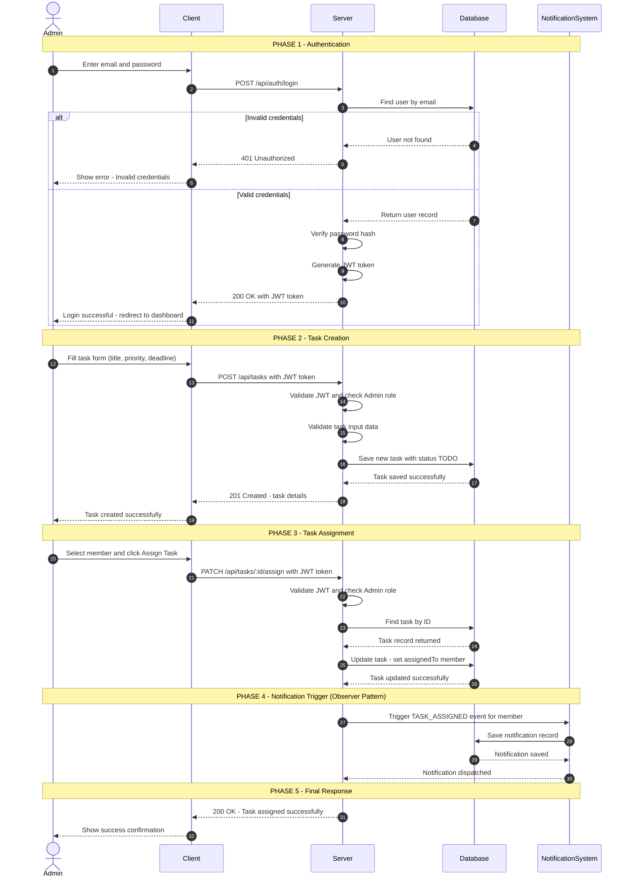
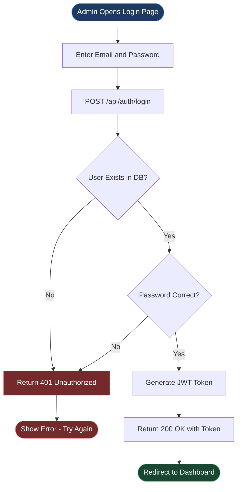
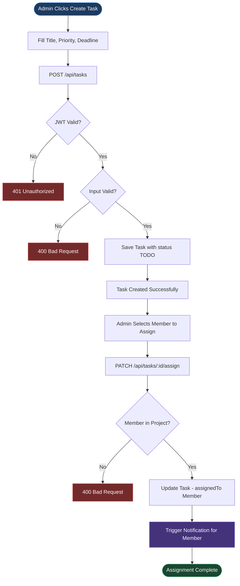
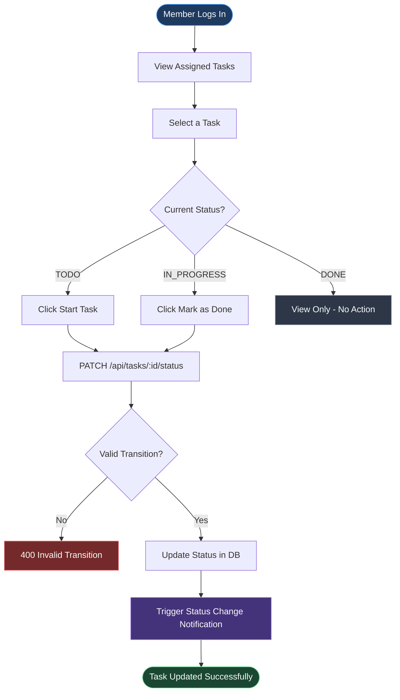

# TaskFlow – Sequence Diagram

> **Milestone:** 1 | **Diagram Type:** Sequence Diagram + Supporting Flowcharts
> **Main Flow:** Admin logs in → creates a task → assigns it to a Member → System triggers a notification

---

## 1. Main Sequence Diagram (5 Phases)

---

## 2. Authentication Flowchart

---

## 3. Task Creation and Assignment Flowchart

---

## 4. Member Task Update Flowchart

---

## 5. Phase Explanation Table

| Phase | Name | Description |
|-------|------|-------------|
| **Phase 1** | Authentication | Admin submits credentials. Server verifies the password hash and issues a JWT token. An `alt` block handles invalid credentials with a `401` response. |
| **Phase 2** | Task Creation | Admin fills the task form. Server validates the JWT, checks the Admin role, validates input, and saves the task with status `TODO`. |
| **Phase 3** | Task Assignment | Admin picks a member. Server verifies the member belongs to the project and updates the task's `assignedTo` field in the database. |
| **Phase 4** | Notification Trigger | Server fires a `TASK_ASSIGNED` event to the Notification System (Observer Pattern). A notification record is saved for the assigned member. |
| **Phase 5** | Final Response | Server returns `200 OK`. Client shows the Admin a success confirmation message. |

---

## 6. Design Pattern Usage

| Pattern | Where Used | How It Works |
|---------|-----------|--------------|
| **Repository Pattern** | Phases 2, 3, 4 | Server never queries the database directly — all DB operations go through repository classes, keeping business logic clean. |
| **Observer Pattern** | Phase 4 | After task assignment, the Server (Subject) notifies the NotificationSystem (Observer) automatically. Notification logic is fully decoupled. |
| **State Pattern** | Phase 3 | Task status follows strict transitions: `TODO → IN_PROGRESS → DONE`. Any invalid jump is rejected with a `400` error. |
| **Singleton Pattern** | All Phases | A single shared database connection is reused across all operations throughout the entire flow. |

---

## 7. Error Scenarios

| Scenario | HTTP Status | Meaning |
|----------|------------|---------|
| Wrong email or password | `401 Unauthorized` | Credentials do not match any user record |
| Missing or expired JWT | `401 Unauthorized` | Token not present or has expired |
| Member role on Admin route | `403 Forbidden` | Insufficient permissions for the action |
| Invalid task input | `400 Bad Request` | Missing required fields or bad data format |
| Member not in project | `400 Bad Request` | Cannot assign task to a non-member |
| Invalid status transition | `400 Bad Request` | Attempted an illegal task state jump |
