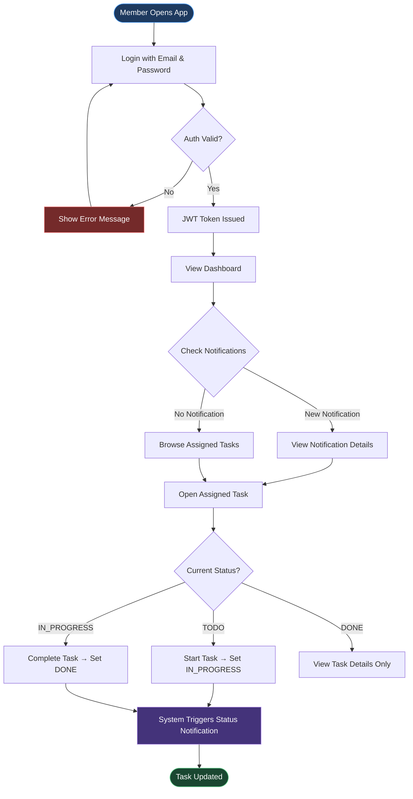

# TaskFlow – Use Case Diagram

> **Milestone:** 1 | **Diagram Type:** Use Case Diagram + Actor Flow Charts

---

## 1. Use Case Diagram

---

## 2. Admin User Journey Flowchart

---

## 3. Member User Journey Flowchart

---

## 4. Use Case Description Table

| Use Case ID | Use Case Name | Actor(s) | Description | Pre-condition | Post-condition |
|-------------|--------------|----------|-------------|---------------|----------------|
| **UC-01** | Register | Admin, Member | New user creates an account with name, email, password, and role. | User does not already exist | User account created; credentials stored securely |
| **UC-02** | Login | Admin, Member | Registered user authenticates to receive a JWT token. | User account exists | JWT token issued; session established |
| **UC-03** | Validate JWT Token | System | System validates the JWT on every protected API request. | JWT token present in request header | Request proceeds or rejected with 401 |
| **UC-04** | Create Project | Admin | Admin creates a new project with name and description. | Admin is authenticated | Project record created in the database |
| **UC-05** | Add Member to Project | Admin | Admin adds a registered Member to a specific project. | Project exists; Member account exists | Member is linked to the project |
| **UC-06** | View Project Details | Admin | Admin views all details of a project including members and tasks. | Admin is authenticated; project exists | Project details returned |
| **UC-07** | Create Task | Admin | Admin creates a task with title, description, priority, and deadline. | Admin is authenticated; project exists | Task created with status "Todo" |
| **UC-08** | Assign Task to Member | Admin | Admin assigns an existing task to a project member. | Task exists; Member is part of the project | Task assigned; notification triggered |
| **UC-09** | View Assigned Tasks | Member | Member views all tasks assigned to them, filterable by status/priority. | Member is authenticated | List of assigned tasks returned |
| **UC-10** | Update Task Status | Member | Member updates the status of an assigned task. | Member is authenticated; task is assigned to them | Task status updated; notification triggered |
| **UC-11** | View Dashboard | Admin | Admin views aggregated project analytics. | Admin is authenticated | Dashboard data returned |
| **UC-12** | Generate Analytics | System | System computes total, completed, overdue tasks and completion %. | Tasks exist in the database | Analytics object returned |
| **UC-13** | Trigger Notification | System | System creates a notification when a task is assigned or status changes. | Task assignment or status change event occurs | Notification record created for the target user |
| **UC-14** | View Notifications | Member | Member views all notifications directed to them. | Member is authenticated | List of notifications returned |

---

## 5. Relationship Legend

| Relationship | Symbol | Meaning |
|-------------|--------|---------|
| **Association** | Solid arrow `→` | Actor initiates the use case |
| **Include** | `<<include>>` | Base use case always invokes the included use case |
| **Extend** | `<<extend>>` | Use case optionally extends the base use case under a condition |
