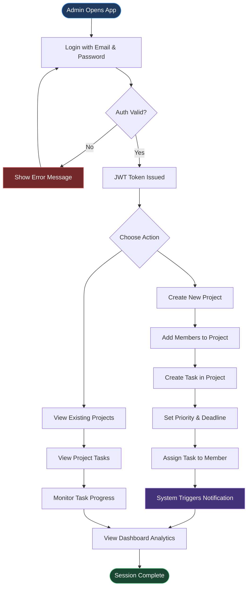

# TaskFlow – Use Case Diagram

---

## 1. Use Case Diagram

```mermaid
graph TB
    %% ─── Actors ───────────────────────────────────────────────────────────────
    Admin([" Admin"])
    Member([" Member"])
    System([" System"])

    %% ─── System Boundary ──────────────────────────────────────────────────────
    subgraph TaskFlow["🖥️ TaskFlow System Boundary"]
        direction TB

        subgraph AUTH[" Authentication"]
            UC1["Register"]
            UC2["Login"]
            UC3["Validate JWT Token"]
        end

        subgraph PROJECT[" Project Management"]
            UC4["Create Project"]
            UC5["Add Member to Project"]
            UC6["View Project Details"]
        end

        subgraph TASK[" Task Management"]
            UC7["Create Task"]
            UC8["Assign Task to Member"]
            UC9["View Assigned Tasks"]
            UC10["Update Task Status"]
        end

        subgraph DASHBOARD[" Dashboard & Analytics"]
            UC11["View Dashboard"]
            UC12["Generate Analytics"]
        end

        subgraph NOTIFY[" Notifications"]
            UC13["Trigger Notification"]
            UC14["View Notifications"]
        end
    end

    %% ─── Admin Associations ───────────────────────────────────────────────────
    Admin --> UC1
    Admin --> UC2
    Admin --> UC4
    Admin --> UC5
    Admin --> UC6
    Admin --> UC7
    Admin --> UC8
    Admin --> UC11

    %% ─── Member Associations ──────────────────────────────────────────────────
    Member --> UC1
    Member --> UC2
    Member --> UC9
    Member --> UC10
    Member --> UC14

    %% ─── System Associations ──────────────────────────────────────────────────
    System --> UC3
    System --> UC12
    System --> UC13

    %% ─── Include Relationships ────────────────────────────────────────────────
    UC2 -->|"<<include>>"| UC3
    UC4 -->|"<<include>>"| UC2
    UC7 -->|"<<include>>"| UC2
    UC11 -->|"<<include>>"| UC12

    %% ─── Extend Relationships ─────────────────────────────────────────────────
    UC8 -->|"<<extend>>"| UC13
    UC10 -->|"<<extend>>"| UC13

    %% ─── Styling ──────────────────────────────────────────────────────────────
    classDef actor fill:#1e3a5f,stroke:#4a9eff,color:#ffffff
    classDef usecase fill:#0f2027,stroke:#4a9eff,color:#e0e0e0
    class Admin,Member,System actor
    class UC1,UC2,UC3,UC4,UC5,UC6,UC7,UC8,UC9,UC10,UC11,UC12,UC13,UC14 usecase
```

---

## 2. Admin User Journey Flowchart

```mermaid
flowchart TD
    A([Admin Opens App]) --> B[Login with Email & Password]
    B --> C{Auth Valid?}
    C -->|No| D[Show Error Message]
    D --> B
    C -->|Yes| E[JWT Token Issued]
    E --> F{Choose Action}

    F --> G[Create New Project]
    G --> H[Add Members to Project]
    H --> I[Create Task in Project]
    I --> J[Set Priority & Deadline]
    J --> K[Assign Task to Member]
    K --> L[System Triggers Notification]
    L --> M[View Dashboard Analytics]
    M --> N([Session Complete])

    F --> O[View Existing Projects]
    O --> P[View Project Tasks]
    P --> Q[Monitor Task Progress]
    Q --> M

    style A fill:#1e3a5f,stroke:#4a9eff,color:#fff
    style N fill:#1a4731,stroke:#68d391,color:#fff
    style D fill:#742a2a,stroke:#fc8181,color:#fff
    style L fill:#44337a,stroke:#b794f4,color:#fff
```

---

## 3. Member User Journey Flowchart

```mermaid
flowchart TD
    A([Member Opens App]) --> B[Login with Email & Password]
    B --> C{Auth Valid?}
    C -->|No| D[Show Error Message]
    D --> B
    C -->|Yes| E[JWT Token Issued]
    E --> F[View Dashboard]
    F --> G{Check Notifications}
    G -->|New Notification| H[View Notification Details]
    H --> I[Open Assigned Task]
    G -->|No Notification| J[Browse Assigned Tasks]
    J --> I
    I --> K{Current Status?}
    K -->|TODO| L[Start Task → Set IN_PROGRESS]
    K -->|IN_PROGRESS| M[Complete Task → Set DONE]
    K -->|DONE| N[View Task Details Only]
    L --> O[System Triggers Status Notification]
    M --> O
    O --> P([Task Updated])

    style A fill:#1e3a5f,stroke:#4a9eff,color:#fff
    style P fill:#1a4731,stroke:#68d391,color:#fff
    style D fill:#742a2a,stroke:#fc8181,color:#fff
    style O fill:#44337a,stroke:#b794f4,color:#fff
```

